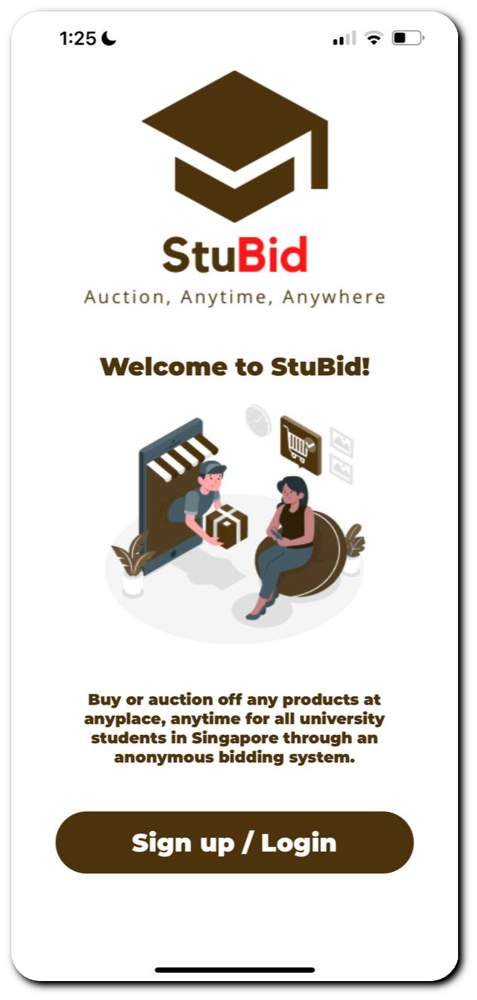

<div id="top"></div>
<!--
*** Thanks for checking out the Best-README-Template. If you have a suggestion
*** that would make this better, please fork the repo and create a pull request
*** or simply open an issue with the tag "enhancement".
*** Don't forget to give the project a star!
*** Thanks again! Now go create something AMAZING! :D
-->

<!-- PROJECT LOGO -->
<br />
<div align="center">
  <a href="https://github.com/anshumaantgi/StuBid">
    
  </a>

<h1 align="center"> <strong> StuBid  <strong/> </h1>

  <p align="center">
    StuBid, also known as 'Student Bidding', is a one-stop mobile application for all students studying in Singapore Universities to conveniently buy or sell unwanted items online through an anonymous bidding system, maximizing the benefits gained by both the seller and buyer.
    <br /> 
    <br /> 
    <a href="https://docs.google.com/document/d/1lPc0IsSOcqIc8ryPoSQZ85QasmspVks4/edit"><strong> Explore the docs »</strong></a>
    <br />
    <br />
    <a href="https://www.figma.com/file/ycRVCcj6LPQZd1haL2gPvv/StuBid?node-id=0%3A1">View Figma Demo</a>
  </p>
</div>


<!-- TABLE OF CONTENTS -->
<details>
  <summary>Table of Contents</summary>
  <ol>
    <li>
      <a href="#about-the-project">About The Project</a>
      <ul>
        <li><a href="#built-with">Built With</a></li>
      </ul>
    </li>
    <li>
      <a href="#getting-started">Getting Started</a>
    </li>
    <li><a href="#contact">Contact</a></li>
  </ol>
</details>


<!-- ABOUT THE PROJECT -->
## About The Project
  <div align ="center">
    <a href="https://expo.dev/@brannn99/StuBid">
  
    </div>
  <h2 align ="center" > <strong> Our Aim </strong> </h2>
      
<p align = "center"> We aim to create a one-stop mobile application which allows students from all Singapore Universities to conveniently buy or sell unwanted items online through an anonymous bidding system, maximizing the benefits gained by both the seller and buyer. </p>
  <br />
  <h2 align ="center" > <strong> How it Works? </strong> </h2>
<p align = "center"> Sellers can upload a photo and the relevant details of their item and set a starting bid of the item. Any interested buyers who search for the item can make a bid higher or equal the starting bid for the item. If the Seller is satisfied with the price bid by the item, he or she can accept the bid offered. Once the bid is successfully accepted, seller and buyer can start to interact and exchange contact information with each other for the transaction to occur. Upon successful transaction, both seller and buyer can leave a review for each other. </p>


<p align="right">(<a href="#top">back to top</a>)</p>


### Built With


* [React Native](https://reactnative.dev/)
* [Expo](https://docs.expo.dev/)
* [Firebase](https://firebase.google.com/docs)
* [Github](https://docs.github.com/en)

<p align="right">(<a href="#top">back to top</a>)</p>


<!-- GETTING STARTED -->
## Getting Started
#### Use either of the two ways listed below to initialise/load the app.

### <b>1. Either initialise the app locally, then run the app. </b>
 
#### Prerequisites
1. Get ready your physical device.
2. Download the Source Code from the repo, Main Branch.
3. Open and run the terminal on the source code directory.
4. Install all neccessary dependencies and libraries with the code below.
5. Run CLI command:  
    ```sh
    npm install
    ```
6. Run CLI command:  
    ```sh
    npm start
    ```
    

#### Installation

1. Download the Expo Go App
2. Register for an Expo account (if you do not have an account)
3. Login into the Expo Go App with your account
4. On your terminal (in the source code directory)
5. Run CLI command:  
    ```sh
    expo start
    ```
6. Scan the QR appearing in the terminal
7. You should be redirected to Expo and App should load on your physical device.

#### Note : If any errors are encountered please contact one of the developers below, contact information is listed below.
    
### <b> 2. Or run the app without downloading the source code (Fast Method) </b>    

#### Installation

1. Get ready your physical device.
2. Download the Expo Go App
3. Login into the Expo Go App with the following Credentials
    ```sh
    Username: stubiduser2122@gmail.com
    Password: testuser2122
    ```
4. Then enter this link in the mobile browser: https://expo.dev/@brannn99/StuBid
5. Scan/Tap QR code on the link
6. App should load and run on your physical device

#### Note : If any errors are encountered please contact one of the developers below, contact information is listed below.
 
<!-- CONTACT -->
## Contact

Developers
    <br />
     - Anshumaan Tyagi - e0866249@u.nus.edu - Telegram: @a_tgi
    <br />
     - Bransome Tan Yi Hao - e0726931@u.nus.edu - Telegram: @brannn99

Project Link: [https://github.com/anshumaantgi/StuBid](https://github.com/anshumaantgi/StuBid)

<p align="right">(<a href="#top">back to top</a>)</p>


<!-- MARKDOWN LINKS & IMAGES -->
<!-- https://www.markdownguide.org/basic-syntax/#reference-style-links -->
[contributors-shield]: https://img.shields.io/github/contributors/github_username/repo_name.svg?style=for-the-badge
[contributors-url]: https://github.com/github_username/repo_name/graphs/contributors
[forks-shield]: https://img.shields.io/github/forks/github_username/repo_name.svg?style=for-the-badge
[forks-url]: https://github.com/github_username/repo_name/network/members
[stars-shield]: https://img.shields.io/github/stars/github_username/repo_name.svg?style=for-the-badge
[stars-url]: https://github.com/github_username/repo_name/stargazers
[issues-shield]: https://img.shields.io/github/issues/github_username/repo_name.svg?style=for-the-badge
[issues-url]: https://github.com/github_username/repo_name/issues
[license-shield]: https://img.shields.io/github/license/github_username/repo_name.svg?style=for-the-badge
[license-url]: https://github.com/github_username/repo_name/blob/master/LICENSE.txt
[linkedin-shield]: https://img.shields.io/badge/-LinkedIn-black.svg?style=for-the-badge&logo=linkedin&colorB=555
[linkedin-url]: https://linkedin.com/in/linkedin_username
[product-screenshot]: images/welcome-slide.jpeg
